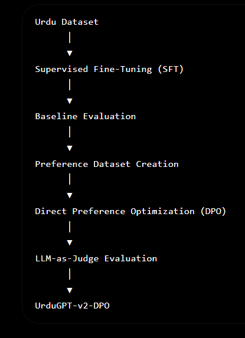

# UrduGPT: Fine-Tuned and DPO-Aligned Urdu Language Model

UrduGPT is an end-to-end LLM engineering project that demonstrates the complete workflow of adapting a pretrained language model for Urdu using Supervised Fine-Tuning (SFT) and Direct Preference Optimization (DPO).

The project covers dataset preparation, parameter-efficient fine-tuning with LoRA, baseline evaluation, preference dataset generation, DPO alignment, and model publishing on Hugging Face. An LLM-as-Judge evaluation pipeline is included to compare the aligned model against the SFT baseline.

---

## Overview

This project implements the following workflow:

- Supervised Fine-Tuning (SFT)
- Baseline Response Evaluation
- Preference Dataset Creation
- Direct Preference Optimization (DPO)
- LLM-as-Judge Evaluation *(In Progress)*

---

## Architecture

<p align="center">
  
</p>

---

## Project Structure

```text
UrduGPT/
│
├── notebooks/
│   ├── 01_SFT_Training.ipynb
│   ├── 02_Baseline_Evaluation.ipynb
│   ├── 03_DPO_Dataset_Creation.ipynb
│   ├── 04_DPO_Training.ipynb
│   └── 05_LLM_as_Judge_Evaluation.ipynb
│
├── datasets/
│
├── images/
│   ├── architecture.png
│   └── training.png
│
├── requirements.txt
├── LICENSE
└── README.md
```

---

## Training Pipeline

The project follows a complete LLM alignment workflow:

1. Fine-tune the base model using an Urdu instruction dataset.
2. Generate baseline responses from the fine-tuned model.
3. Construct a preference dataset containing prompts, chosen responses, and rejected responses.
4. Align the model using Direct Preference Optimization (DPO).
5. Compare the SFT and DPO models using an LLM-as-Judge evaluation pipeline.

---

## Technical Stack

### Frameworks

- PyTorch
- Hugging Face Transformers
- TRL
- PEFT
- Unsloth

### Tools

- Google Colab
- Hugging Face Hub
- Groq API

### Languages

- Python
- JSON

---

## Models

### Base Model

- Llama 3.2 3B Instruct (4-bit, Unsloth)

### Fine-Tuned Model

- https://huggingface.co/mfayazkhan/UrduGPT-v2

### DPO-Aligned Model

- https://huggingface.co/mfayazkhan/UrduGPT-v2-DPO

---

## Installation

Clone the repository.

```bash
git clone https://github.com/mfayazkhan/UrduGPT.git
cd UrduGPT
```

Install the dependencies.

```bash
pip install -r requirements.txt
```

---

## Repository Workflow

| Notebook | Description |
|----------|-------------|
| 01_SFT_Training.ipynb | Fine-tune the base model using LoRA |
| 02_Baseline_Evaluation.ipynb | Generate baseline responses |
| 03_DPO_Dataset_Creation.ipynb | Build the preference dataset |
| 04_DPO_Training.ipynb | Train the model using DPO |
| 05_LLM_as_Judge_Evaluation.ipynb | Evaluate SFT vs DPO models |

---

## Results

Completed:

- Fine-tuned an Urdu language model using LoRA.
- Built a preference dataset for alignment.
- Trained a DPO-aligned model using TRL and Unsloth.
- Published both models on Hugging Face.

Pending:

- Complete the LLM-as-Judge evaluation.
- Benchmark against additional open-source models.

---

## Future Work

- Expand the Urdu instruction dataset.
- Increase the preference dataset size.
- Perform quantitative benchmarking.
- Deploy the model using a production inference framework.
- Build a web-based chat interface.

---

## License

This project is released under the MIT License.

---

## Author

**Muhammad Fayaz Khan**

- GitHub: https://github.com/mfayazkhan
- Hugging Face: https://huggingface.co/mfayazkhan
- LinkedIn: *(Add your LinkedIn profile)*